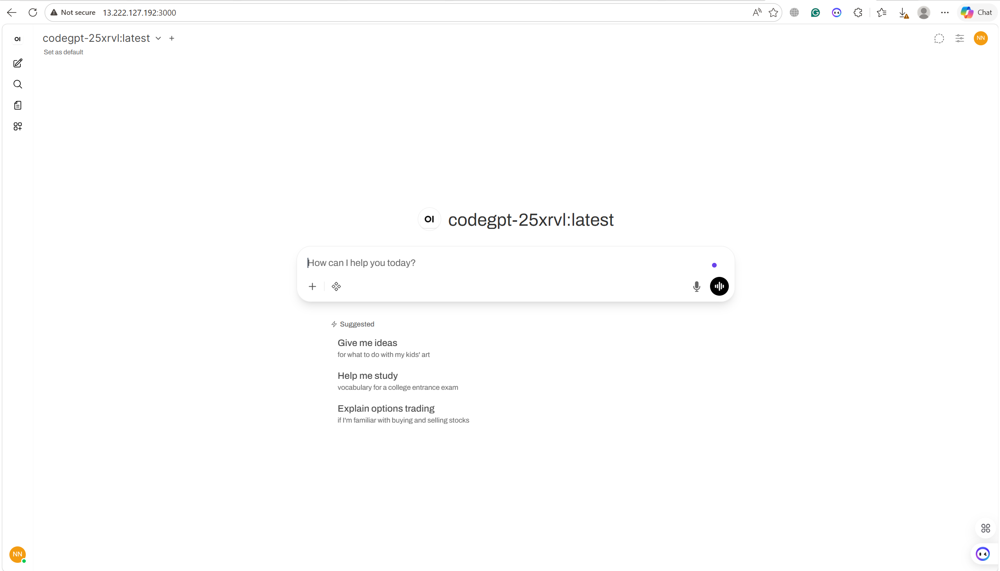

# cisc 886 cloud project - cloud-based conversational chatbot

[](https://www.linkedin.com/in/nataliemonged/)
[](https://www.linkedin.com/in/elsayed-elmandoh-b5849a1b8/)
[](https://www.linkedin.com/in/manar-elshenawy-/)
[]()
[](https://x.com/aangpy)


<p align="center">
  
</p>

## table of contents

1. [project overview](#1-project-overview)
2. [project structure](#2-project-structure)
3. [getting started](#3-getting-started)
4. [configuration](#4-configuration)
5. [commands and usage](#5-commands-and-usage)
6. [notebooks and sections](#6-notebooks-and-sections)
7. [source code modules](#7-source-code-modules)
8. [data directories](#8-data-directories)
9. [documentation](#9-documentation)
10. [infrastructure and terraform](#10-infrastructure-and-terraform)
11. [dependencies](#11-dependencies)
12. [cloud services](#12-cloud-services)
13. [model and dataset](#13-model-and-dataset)
14. [troubleshooting](#14-troubleshooting)
15. [aws cost summary](#15-aws-cost-summary)
16. [additional resources](#16-additional-resources)
17. [contributing](#contributing)
18. [author](#author)

---

## 1. project overview

this project is a cloud-based conversational chatbot using aws (ec2, emr, s3) designed to fine-tune large language models (unsloth/trl) on cloud infrastructure. it provides a self-hosted ai coding assistant that can run on aws cloud infrastructure.

**problem statement**: developers often need immediate coding assistance but lack access to efficient, domain-specific ai assistants that can run locally or on cloud infrastructure without significant costs or latency. existing commercial solutions like chatgpt or github copilot require subscription fees and send code data to external servers, raising privacy concerns for enterprise codebases.

**solution**: a 1.1b parameter model (tinyllama) fine-tuned on domain-specific code data, deployed on aws infrastructure with a web interface for easy interaction.

**key features**:
- fine-tuning with qlora (4-bit quantization)
- cloud-native preprocessing with apache spark on emr
- model serving with ollama on ec2
- web interface with openwebui
- secure vpc networking

---

## 2. project structure

```
cisc886-cloud-project/
├── app.py                          # main entry point with cli commands
├── requirements.txt                # python dependencies
├── .env                            # environment variables (secrets)
├── .env.example                    # example environment variables
├── .gitignore                      # git ignore rules
├── license                         # project license
│
├── src/                            # source code modules
│   ├── __init__.py
│   ├── config/
│   │   ├── __init__.py
│   │   └── settings.py             # configuration settings and defaults
│   ├── utils/
│   │   ├── __init__.py
│   │   ├── helpers.py              # shared helper functions
│   │   └── upload_data_to_s3.py    # s3 upload utilities
│   ├── preprocessing/
│   |   ├── __init__.py
│   │   └── preprocess_emr.py       # emr preprocessing scripts
│   └── infrastructure/
│       ├── __init__.py
│       └── main.tf                 # terraform infrastructure code
│
├── notebooks/                      # jupyter notebooks (7 sections)
│   ├── 00-quickstart.ipynb
│   ├── 01-system-architecture/
│   │   ├── 00-quickstart.ipynb
│   │   └── 01-architecture.ipynb
│   ├── 02-vpc-and-networking/
│   │   ├── 00-quickstart.ipynb
│   │   └── 01-vpc-networking.ipynb
│   ├── 03-model-and-dataset-selection/
│   │   ├── 00-quickstart.ipynb
│   │   └── 01-model-dataset-selection.ipynb
│   ├── 04-data-preprocessing-with-apaches-spark-on-emr/
│   │   ├── 00-quickstart.ipynb
│   │   └── 01-preprocessing.ipynb
│   ├── 05-model-fine-tuning/
│   │   ├── 00-quickstart.ipynb
│   │   ├── 01-fine-tuning.ipynb
│   │   └── 02-model-comparison.ipynb
│   ├── 06-model-deployment-on-ec2/
│   │   ├── 00-quickstart.ipynb
│   │   └── 01-deployment.ipynb
│   └── 07-web-interface/
│       ├── 00-quickstart.ipynb
│       └── 01-web-interface.ipynb
│
├── data/                           # data directories
│   ├── 00-quickstart.md
│   ├── smol_ids_data/              # raw dataset (parquet files)
│   │   ├── train-00000-of-00064.parquet
│   │   ├── train-00001-of-00064.parquet
│   │   └── train-00002-of-00064.parquet
│   └── [additional data subdirectories]
│
└── docs/                           # documentation
    ├── 00-research/
    │   ├── 00-quickstart.md
    │   ├── 01-project-definition.md
    │   ├── 02-project-deliverable.md
    │   ├── 03-project-resource-guide-model-selection-tooling-and-fine-tuning.md
    │   ├── 04-research-notes.md
    │   └── 05-references.md
    ├── 01-project-definition/
    │   ├── 00-quickstart.md
    │   ├── 01-problem.md
    │   ├── 02-goal.md
    │   ├── 03-solution.md
    │   ├── 04-dataset.md
    │   ├── 05-constraints.md
    │   ├── 06-stack.md
    │   ├── 07-architecture.md
    │   ├── 08-workflow.md
    │   ├── 09-structure.md
    │   └── 10-timeline.md
    └── 02-project-deliverable/
        ├── 00-quickstart.md
        ├── final-report.md
        ├── final-report.docx
        ├── 01-system-architecture/
        │   ├── 00-quickstart.md
        │   ├── 01-reasoning.md
        │   └── 02-submit.md
        ├── 02-vpc-and-networking/
        │   ├── 00-quickstart.md
        │   ├── 01-reasoning.md
        │   └── 02-submit.md
        ├── 03-model-and-dataset-selection/
        │   ├── 00-quickstart.md
        │   ├── 01-reasoning.md
        │   └── 02-submit.md
        ├── 04-data-preprocessing-with-apaches-spark-on-emr/
        │   ├── 00-quickstart.md
        │   ├── 01-reasoning.md
        │   └── 02-submit.md
        ├── 05-model-fine-tuning/
        │   ├── 00-quickstart.md
        │   ├── 01-reasoning.md
        │   ├── 02-submit.md
        │   └── 03-colab-setup.md
        ├── 06-model-deployment-on-ec2/
        │   ├── 00-quickstart.md
        │   ├── 01-reasoning.md
        │   └── 02-submit.md
        └── 07-web-interface/
            ├── 00-quickstart.md
            ├── 01-reasoning.md
            └── 02-submit.md
```

---

## 3. getting started

### 3.1 prerequisites

- python 3.12+
- conda (recommended for environment management)
- aws account with access credentials
- jupyter notebook

### 3.2 installation

1. **clone the repository**:
```bash
git clone <repository-url>
cd cisc886-cloud-project
```

2. **create and activate conda environment**:
```bash
conda create -n cisc886 python=3.12
conda activate cisc886
```

3. **install dependencies**:
```bash
pip install -r requirements.txt
```

4. **configure environment variables**:
```bash
cp .env.example .env
# edit .env with your aws credentials and configuration
```

### 3.3 verify installation

```bash
python app.py help
python app.py config
python app.py s3-test
```

---

## 4. configuration

configuration is managed through environment variables in the `.env` file. all settings are defined in `src/config/settings.py`.

### 4.1 aws configuration

| variable | default | description |
|----------|---------|-------------|
| `region` | us-east-1 | aws region |
| `bucket_name` | 25xrvl-s3 | s3 bucket name |
| `net_id` | 25xrvl | network identifier |
| `vpc_cidr` | 10.0.0.0/16 | vpc cidr block |
| `public_subnet_cidr` | 10.0.1.0/24 | public subnet cidr |
| `private_subnet_cidr` | 10.0.2.0/24 | private subnet cidr |
| `emr_subnet_cidr` | 10.0.3.0/24 | emr subnet cidr |

### 4.2 ec2 configuration

| variable | default | description |
|----------|---------|-------------|
| `ec2_instance_name` | 25xrvl-ec2 | ec2 instance name |
| `ec2_instance_type` | t3.2xlarge | ec2 instance type for model serving |
| `ec2_ami` | deep learning ami (ubuntu 20.04) | ami for ec2 |
| `ec2_storage_gb` | 100 | storage size in gb |
| `ec2_volume_type` | gp3 | volume type |

### 4.3 emr configuration

| variable | default | description |
|----------|---------|-------------|
| `emr_cluster_name` | 25xrvl-emr-final | emr cluster name |
| `emr_instance_type` | m5.xlarge | instance type (master + core) |
| `emr_num_core_nodes` | 2 | number of core nodes |
| `emr_total_nodes` | 3 | total nodes (1 master + 2 core) |
| `emr_release` | emr-7.2.0 | emr release version |

### 4.4 model configuration

| variable | default | description |
|----------|---------|-------------|
| `model_name` | tinyllama-1.1b-chat-v1.0 | model name |
| `model_id` | tinyllama/tinyllama-1.1b-chat-v1.0 | hugging face model id |
| `model_max_seq_length` | 2048 | maximum sequence length |
| `model_load_in_4bit` | true | load model in 4-bit |
| `model_lora_r` | 16 | lora r dimension |
| `model_lora_alpha` | 16 | lora alpha |
| `model_lora_dropout` | 0 | lora dropout |
| `model_learning_rate` | 2e-4 | learning rate |
| `model_batch_size` | 2 | batch size |
| `model_epochs` | 3 | number of epochs |

### 4.5 dataset configuration

| variable | default | description |
|----------|---------|-------------|
| `dataset_name` | bigcode/the-stack-smol | dataset name |
| `dataset_id` | bigcode/the-stack-v2-train-smol-ids | dataset id |
| `dataset_min_content_length` | 50 | minimum content length |
| `dataset_train_split` | 0.8 | train split ratio |
| `dataset_val_split` | 0.1 | validation split ratio |
| `dataset_test_split` | 0.1 | test split ratio |

---

## 5. commands and usage

### 5.1 available commands

```bash
# show help
python app.py help

# show current configuration
python app.py config

# run specific section notebook (1-7)
python app.py notebook <section>

# run all notebooks
python app.py notebooks

# list files in s3 bucket
python app.py s3-list

# test s3 connection
python app.py s3-test
```

### 5.2 section mapping

| section number | description | notebook |
|----------------|-------------|----------|
| 1 | system architecture | notebooks/01-system-architecture/01-architecture.ipynb |
| 2 | vpc and networking | notebooks/02-vpc-and-networking/01-vpc-networking.ipynb |
| 3 | model and dataset selection | notebooks/03-model-and-dataset-selection/01-model-dataset-selection.ipynb |
| 4 | data preprocessing with emr | notebooks/04-data-preprocessing-with-apaches-spark-on-emr/01-preprocessing.ipynb |
| 5 | model fine-tuning | notebooks/05-model-fine-tuning/01-fine-tuning.ipynb |
| 6 | model deployment on ec2 | notebooks/06-model-deployment-on-ec2/01-deployment.ipynb |
| 7 | web interface | notebooks/07-web-interface/01-web-interface.ipynb |

---

## 6. notebooks and sections

### 6.1 section 1: system architecture

**path**: `notebooks/01-system-architecture/01-architecture.ipynb`

covers the overall system architecture, component boundaries, and data flow between s3, emr, colab, ec2, and openwebui.

**key topics**:
- architecture diagram
- component purposes and connections
- state management
- failure points

**documentation**:
- `docs/02-project-deliverable/01-system-architecture/01-reasoning.md`
- `docs/02-project-deliverable/01-system-architecture/02-submit.md`
- `docs/01-project-definition/07-architecture.md`

### 6.2 section 2: vpc and networking

**path**: `notebooks/02-vpc-and-networking/01-vpc-networking.ipynb`

covers aws vpc setup, subnet configuration, security groups, and terraform infrastructure as code.

**key topics**:
- vpc creation with public and private subnets
- internet gateway and routing
- security group configuration
- terraform deployment

**terraform file**: `src/infrastructure/main.tf`

**documentation**:
- `docs/02-project-deliverable/02-vpc-and-networking/01-reasoning.md`
- `docs/02-project-deliverable/02-vpc-and-networking/02-submit.md`

### 6.3 section 3: model and dataset selection

**path**: `notebooks/03-model-and-dataset-selection/01-model-dataset-selection.ipynb`

covers selection criteria for base model and dataset, including performance, size, and licensing considerations.

**key topics**:
- model comparison (tinyllama vs alternatives)
- dataset selection (bigcode/the-stack)
- evaluation metrics
- fine-tuning feasibility

**documentation**:
- `docs/02-project-deliverable/03-model-and-dataset-selection/01-reasoning.md`
- `docs/02-project-deliverable/03-model-and-dataset-selection/02-submit.md`
- `docs/01-project-definition/04-dataset.md`

### 6.4 section 4: data preprocessing with apache spark on emr

**path**: `notebooks/04-data-preprocessing-with-apaches-spark-on-emr/01-preprocessing.ipynb`

covers data loading, filtering, and preprocessing using pyspark on aws emr cluster.

**key topics**:
- loading data from hugging face
- filtering by programming language
- content length filtering
- license filtering
- deduplication
- train/val/test split

**scripts**:
- `src/preprocessing/preprocess_emr.py`
- `src/utils/helpers.py` (spark utilities)

**s3 paths**:
- raw data: `s3://{bucket}/smol_ids_data/`
- processed train: `s3://{bucket}/processed/train/`
- processed val: `s3://{bucket}/processed/val/`
- processed test: `s3://{bucket}/processed/test/`

**documentation**:
- `docs/02-project-deliverable/04-data-preprocessing-with-apaches-spark-on-emr/01-reasoning.md`
- `docs/02-project-deliverable/04-data-preprocessing-with-apaches-spark-on-emr/02-submit.md`

### 6.5 section 5: model fine-tuning

**path**: `notebooks/05-model-fine-tuning/01-fine-tuning.ipynb`

covers fine-tuning tinyllama with qlora using unsloth and trl libraries.

**key topics**:
- loading base model with 4-bit quantization
- configuring lora adapters
- training configuration
- model evaluation
- gguf export

**additional notebooks**:
- `notebooks/05-model-fine-tuning/02-model-comparison.ipynb`

**documentation**:
- `docs/02-project-deliverable/05-model-fine-tuning/01-reasoning.md`
- `docs/02-project-deliverable/05-model-fine-tuning/02-submit.md`
- `docs/02-project-deliverable/05-model-fine-tuning/03-colab-setup.md`

### 6.6 section 6: model deployment on ec2

**path**: `notebooks/06-model-deployment-on-ec2/01-deployment.ipynb`

covers deploying fine-tuned model on ec2 using ollama for local inference.

**key topics**:
- ec2 instance setup
- ollama installation
- model loading and serving
- api testing

**configuration**:
- ollama port: 11434 (default)
- api base: `http://localhost:11434`
- model name: 25xrvl-codegpt
- model file: 25xrvl-tinyllama-codegpt-q4_k_m.gguf
- s3 bucket (models): 25xrvl-s3

**documentation**:
- `docs/02-project-deliverable/06-model-deployment-on-ec2/01-reasoning.md`
- `docs/02-project-deliverable/06-model-deployment-on-ec2/02-submit.md`

### 6.7 section 7: web interface

**path**: `notebooks/07-web-interface/01-web-interface.ipynb`

covers setting up openwebui for user-friendly interaction with the deployed model.

**key topics**:
- openwebui installation
- connecting to ollama api
- user interface features

**configuration**:
- openwebui port: 3000 (default)
- url: `http://localhost:3000`

**documentation**:
- `docs/02-project-deliverable/07-web-interface/01-reasoning.md`
- `docs/02-project-deliverable/07-web-interface/02-submit.md`

---

## 7. source code modules

### 7.1 config module

**path**: `src/config/settings.py`

contains all configuration settings including aws, ec2, emr, model, dataset, s3 paths, ollama, and openwebui configurations. uses environment variables with sensible defaults.

### 7.2 utils module

**path**: `src/utils/helpers.py`

shared helper functions including:
- s3 operations (upload, download, list)
- data processing (filtering, splitting)
- spark session creation
- notebook execution
- configuration printing

**additional utilities**:
- `src/utils/upload_data_to_s3.py` - s3 upload utilities
- `src/utils/pdf_to_md.py` - pdf conversion to markdown

### 7.3 preprocessing module

**path**: `src/preprocessing/preprocess_emr.py`

emr-specific preprocessing scripts for running pyspark jobs on aws emr cluster.

### 7.4 infrastructure module

**path**: `src/infrastructure/main.tf`

terraform configuration for aws infrastructure including vpc, subnets, security groups, and ec2 instance.

---

## 8. data directories

| directory | path | description |
|-----------|------|-------------|
| root | `data/` | base data directory |
| raw | `data/smol_ids_data/` | raw data storage |

### 8.1 dataset storage

the project uses the bigcode/the-stack-smol dataset stored in s3:
- raw data: `s3://25xrvl-s3/smol_ids_data/`
- processed data: `s3://25xrvl-s3/processed/{train,val,test}/`
- models: `s3://25xrvl-s3/models/25xrvl-tinyllama-codegpt-q4_k_m.gguf`

---

## 9. documentation

### 9.1 research documentation

**path**: `docs/00-research/`

- `00-quickstart.md` - quickstart guide
- `01-project-definition.md` - project definition
- `02-project-deliverable.md` - project deliverables
- `03-project-resource-guide-model-selection-tooling-and-fine-tuning.md` - resource guide
- `04-research-notes.md` - research notes
- `05-references.md` - references

### 9.2 project definition

**path**: `docs/01-project-definition/`

- `00-quickstart.md` - quickstart guide
- `01-problem.md` - problem statement
- `02-goal.md` - project goals
- `03-solution.md` - solution approach
- `04-dataset.md` - dataset details
- `05-constraints.md` - project constraints
- `06-stack.md` - technology stack
- `07-architecture.md` - system architecture
- `08-workflow.md` - workflow
- `09-structure.md` - project structure
- `10-timeline.md` - project timeline

### 9.3 project deliverables

**path**: `docs/02-project-deliverable/`

contains reasoning and submission documents for each of the 7 sections:
- `01-system-architecture/`
- `02-vpc-and-networking/`
- `03-model-and-dataset-selection/`
- `04-data-preprocessing-with-apaches-spark-on-emr/`
- `05-model-fine-tuning/`
- `06-model-deployment-on-ec2/`
- `07-web-interface/`

---

## 10. infrastructure and terraform

### 10.1 terraform configuration

**path**: `src/infrastructure/main.tf`

contains aws infrastructure as code including:
- vpc creation
- subnet configuration (public, private, emr)
- internet gateway
- route tables
- security groups
- ec2 instance definition

### 10.2 aws resources

| resource | type | description |
|----------|------|-------------|
| vpc | aws_vpc | 10.0.0.0/16 |
| public subnet | aws_subnet | 10.0.1.0/24 |
| private subnet | aws_subnet | 10.0.2.0/24 |
| emr subnet | aws_subnet | 10.0.3.0/24 |
| internet gateway | aws_internet_gateway | internet access |
| security groups | aws_security_group | network access control |

---

## 11. dependencies

### 11.1 core dependencies

```
boto3>=1.34.0
datasets>=2.14.0
torch>=2.0.0
unsloth>=2024.1.0
trl>=0.7.0
accelerate>=0.25.0
bitsandbytes>=0.41.0
huggingface-hub>=0.20.0
jupyter>=1.0.0
pandas>=2.0.0
pyarrow>=14.0.0
requests>=2.31.0
python-dotenv>=1.0.0
```

### 11.2 additional dependencies (based on usage)

- pyspark (for emr preprocessing)
- matplotlib, seaborn (visualization)
- scikit-learn (evaluation)
- numpy (numerical operations)

---

## 12. cloud services

### 12.1 aws services used

| service | purpose | configuration |
|---------|---------|---------------|
| s3 | data and model storage | bucket: 25xrvl-s3 |
| emr | spark preprocessing | cluster: 25xrvl-emr-final |
| ec2 | model serving | instance: t3.2xlarge |
| vpc | networking | cidr: 10.0.0.0/16 |

### 12.2 cloud architecture

```
                                    internet
                                        |
                                        v
                              +-------------------+
                              |   internet gateway|
                              +-------------------+
                                        |
                                        v
                              +-------------------+
                              |   load balancer   |
                              +-------------------+
                                        |
                                        v
                              +-------------------+
                              |   ec2 (t3.2xlarge)|
                              |   + ollama        |
                              |   + openwebui    |
                              +-------------------+
                                        ^
                                        |
                              +-------------------+
                              |   s3 bucket       |
                              |   25xrvl-s3       |
                              +-------------------+
                                        ^
                                        |
                              +-------------------+
                              |   emr cluster     |
                              |   (pyspark)        |
                              +-------------------+
```

---

## 13. model and dataset

### 13.1 base model

| property | value |
|----------|-------|
| name | tinyllama-1.1b-chat-v1.0 |
| model id | tinyllama/tinyllama-1.1b-chat-v1.0 |
| parameters | 1.1b |
| context length | 2048 |
| quantization | 4-bit qlora |

### 13.2 dataset

| property | value |
|----------|-------|
| name | bigcode/the-stack-smol |
| dataset id | bigcode/the-stack-v2-train-smol-ids |
| languages | python, javascript, go |
| min content length | 50 |

### 13.3 fine-tuning configuration

| parameter | value |
|-----------|-------|
| lora r | 16 |
| lora alpha | 16 |
| lora dropout | 0 |
| learning rate | 2e-4 |
| batch size | 2 |
| epochs | 3 |
| gradient checkpointing | unsloth |
| random seed | 3407 |

### 13.4 training results

| metric | value |
|--------|-------|
| training samples | 23,860 |
| validation samples | 2,983 |
| total steps | 4,476 |
| training time | ~6 hours (colab t4) |
| initial loss | 1.13 |
| final loss | ~0.60 |
| trainable parameters | 1.13% (12.6m / 1.1b) |

**training loss curve**: see notebook `notebooks/05-model-fine-tuning/01-fine-tuning.ipynb` for step-by-step loss values (decreasing from ~1.13 to ~0.60)

---

## 14. troubleshooting

### 14.1 common issues

**s3 connection errors**:
- verify aws credentials in .env file
- check that aws access key has s3 permissions
- verify bucket name is correct

**jupyter notebook not found**:
```bash
pip install jupyter
```

**import errors**:
```bash
pip install -r requirements.txt
```

**environment variables not loading**:
- ensure .env file exists in project root
- check that python-dotenv is installed

### 14.2 verification commands

```bash
# test s3 connection
python app.py s3-test

# list s3 files
python app.py s3-list

# show configuration
python app.py config
```

---

## 15. aws cost summary

| service | usage description | free tier status | estimated cost |
|---------|-------------------|------------------|----------------|
| amazon ec2 | hosting ollama, openwebui, docker containers | covered (750 hours/month) | $0.00 |
| amazon emr | large-scale data processing and cluster management | not free tier (m5.xlarge typical) | $1.20 - $3.50 |
| amazon s3 | storage for model checkpoints, datasets | covered (up to 5gb) | $0.00 |
| aws iam | managing roles for s3 and ec2 access | always free | $0.00 |
| ebs storage | ssd volumes for ec2 os and docker images | covered (up to 30gb) | $0.00 |
| data transfer | egress traffic for docker pulls and web access | covered (up to 100gb) | $0.15 |
| | | **total estimated** | **$1.35 - $3.65** |

**cost optimization tips**:
- always terminate emr cluster after preprocessing (required for grading)
- stop ec2 instance when not in use
- use s3 lifecycle policies for old data
- colab free tier used for fine-tuning (no aws cost)

---

## 16. additional resources

- final report: `docs/02-project-deliverable/final-report.docx`
- architecture details: `docs/01-project-definition/07-architecture.md`
- stack overview: `docs/01-project-definition/06-stack.md`
- workflow: `docs/01-project-definition/08-workflow.md`

---

## 17. contributing

contributions are welcome! if you would like to improve this project, please follow these steps:

1. fork the repository.
2. create a branch for your feature or bug fix (git checkout -b feature/my-new-feature).
3. commit your changes with clear messages (git commit -m 'add some feature').
4. push to your fork (git push origin feature/my-new-feature)
5. open a pull request.

## 18. author

- elsayed elmandoh - ai engineer - [linkedin](https://www.linkedin.com/in/nataliemonged/)
- elsayed elmandoh - ai engineer - [linktree](https://linktr.ee/elsayedelmandoh)
- elsayed elmandoh - ai engineer - [linkedin](https://www.linkedin.com/in/manar-elshenawy-/)
---

*project for cisc8868 - cloud computing - queen's university, canada | may 2026*